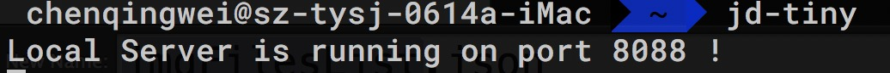

# jd-tiny
可对一整个项目进行打包，自动处理文件间与图片的依赖关系，并能实现图片压缩、上传、线上链接替换等

## 全局安装
```bash
npm install jd-tiny -g
```

## 教程

在命令行输入`jd-tiny`，会看到本地服务开启的提示，然后浏览器会自动打开`http://localhost:8088`
<div align="center">
	
</div>

操作过程如下：
<div align="center">
	
</div>

解压完处理完的项目文件夹之后，会看到原先项目中的图片都不见了，并且都转换成了线上https链接，且每张图片都经过了压缩。